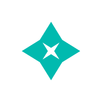

# Adsie 

Adsie is a revolutionary platform where users can earn ADS tokens by engaging with ads posted by organizations. Our ERC20-based token, ADS, powers all transactions within the platform. Enterprises can seamlessly promote their products or services through images and videos, providing users with an opportunity to view and earn ADS tokens.

## Table of Contents
- [Introduction](#introduction)
- [Tech Stack](#tech-stack)
- [Live Demo](#live-demo)
- [Usage](#usage)
- [Pages](#pages)
  - [Homepage](#homepage)
  - [User's Side](#users-side)
  - [Enterprise Side](#enterprise-side)

## Introduction 🌐📺💰

Welcome to Adsie, the future of advertising and tokenized engagement! Earn ADS tokens by watching ads, and enterprises can boost their reach through our innovative platform. Get ready to dive into the world of decentralized advertising!

## Tech Stack 💻🔧

- **Solidity**: Smart contracts for secure and transparent transactions.
- **Next.js**: A React framework for building efficient and scalable web applications.
- **Rainbow**: [Rainbow](https://github.com/nexgencode/rainbow), a versatile library for styling your Next.js applications with ease.

## Live Demo 🚀

Check out our live demo [here](link-to-live-demo) to experience the power of Adsie.

## Pages 📸

### User's Side

<kbd>  </kbd>

### User's Dashboard

<kbd>  </kbd>

### Enterprise's Side

<kbd>  </kbd>

### Enterprise's Dashboard
<kbd>  </kbd>

